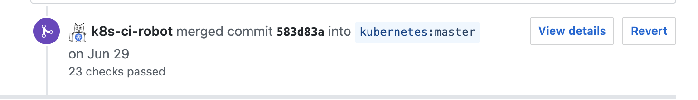
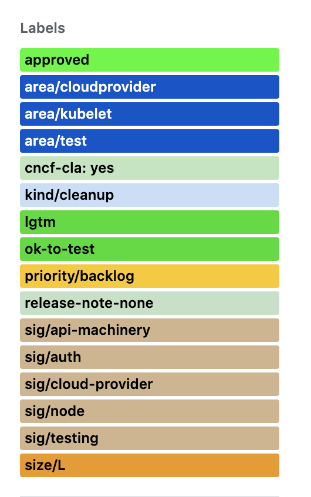

So, finally started [contributing to the Kubernetes source code on github](https://github.com/kubernetes/kubernetes/pulls/sukeesh). At first, I was really worried after looking at the source code as It was too huge. But finally, I made up my mind to start with [good first issues](https://github.com/kubernetes/kubernetes/issues?q=is%3Aopen+is%3Aissue+label%3A%22good+first+issue%22). 

Most of the good first issues were to cleanup the source code, add docs in the code kind of stuff and seemed really easy to me. So, came up with this PR [#79367](https://github.com/kubernetes/kubernetes/pull/79367) to start off. The code review flow was really good (even though took a bit time) and this PR was finally merged by the bot. :wink:



I was really happy on that day. I was little more encouraged to contribute more. So, now came up with this huge PR[#79566](https://github.com/kubernetes/kubernetes/pull/79566), which does solve the same issue of capitalizing error strings. I changed the code in various places (31 files). So, it involved various packages:cry: and this really took a long time to get the code approved :ballot_box_with_check: as there are different maintainers for each package.




So, now that I'm little familiar with this, I was excited to fix some more real bugs/issues. I actually found a small bug wherein Horizontal Pod Autoscaler was showing incorrect status in the events log. 
For example, the case when
```go
desiredReplicas = 1
minimumAllowedReplicas = 2
hpaMinReplicas = 2
```
Event logs said 
```
TooFewReplicas
the desired replica count is more than the maximum replica count
```
which defnitely is wrong and when I read the code realted to autoscaler part, I found the issue:sweat_smile:<br>
I, Immediately came up with this PR [#79859](https://github.com/kubernetes/kubernetes/pull/79859). <br> 
I was very happy at the point when this PR was merged. So, now again started to look over some of the open issues on github and no luck this time. But found some issue where this guy very new to Kubernetes was having hard time [Issue #79678](https://github.com/kubernetes/kubernetes/issues/79678)

So, was thinking of my next contribution and came up with the feature of flushing out the current namespace when there are no resources found [#79968](https://github.com/kubernetes/kubernetes/pull/79968) :smile:

I made these contributions in under a month and looking forward to contributing more to CNCF Projects.

I have also made a habit of reading the source code, If I have a doubt regarding anything related to kubernetes and I feel like this is the best way to learn.


