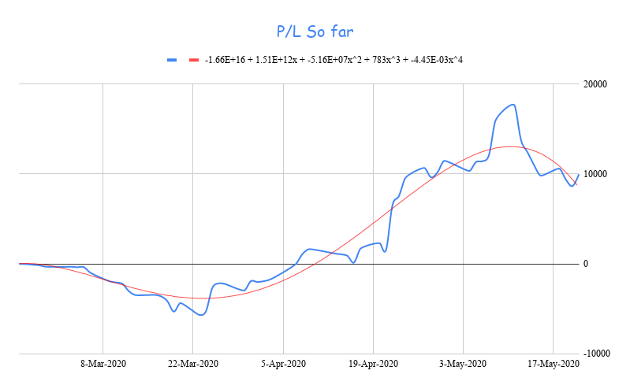

  

## Disclaimer

"I am NOT a SEBI registered advisor or a financial adviser. Any of my investment or trades I share on my blog are provided for educational purposes only and do not constitute specific financial, trading or investment advice"

You should discuss your specific requirements and situation with a qualified financial adviser

 

----------

 

I tried to see how much Profit/Loss one would have made if he/she brought a unit of stock <b>daily</b> in the following Instruments.

I picked the following randomly from the [NIFTY50 Index](https://www1.nseindia.com/live_market/dynaContent/live_watch/equities_stock_watch.htm).

 

## Motivation

<i>Burton Malkiel</i> famously wrote in [A Random Walk Down Wall Street](https://amzn.to/2zXGVdu) that
> A blindfolded monkey throwing darts at a newspaper's financial pages could select a portfolio that would do just as well as one carefully selected by the experts.

 

----------

## Assumptions

For each day, there is a low price and a high price. I have chosen the average value of these two as the buy price on that day. 

### Why average?

It’s impossible for anyone to predict the bottom of the chart in the stock market. So, anyone who has chosen the lowest price traded on that day is very lucky and anyone who has chosen the highest price traded on that day is very unlucky.

In the following charts, “Cum cost” represents the cumulative cost of all the units you brought so far and “Cum value” represents the current value of all the units you brought so far.

Let’s explore!

## [Tata Consultancy Services Limited](https://www1.nseindia.com/live_market/dynaContent/live_watch/get_quote/GetQuote.jsp?symbol=TCS)

You would have made a profit of INR 5700!!.

-------------

## [Reliance Industries Limited](https://www1.nseindia.com/live_market/dynaContent/live_watch/get_quote/GetQuote.jsp?symbol=RELIANCE)

You would have made a profit of around INR 10000!!

-------------

## [HDFC Bank Limited](https://www1.nseindia.com/live_market/dynaContent/live_watch/get_quote/GetQuote.jsp?symbol=HDFCBANK)

You would have made a LOSS of around INR 5300!!

-------------

## [Dr. Reddy's Laboratories Limited](https://www1.nseindia.com/live_market/dynaContent/live_watch/get_quote/GetQuote.jsp?symbol=DRREDDY)

You would have made a profit of around INR 26000!!

-------------

## [State Bank of India](https://www1.nseindia.com/live_market/dynaContent/live_watch/get_quote/GetQuote.jsp?symbol=SBIN)

You would have made a LOSS of around INR 3100!!

-------------

## Conclusion

This is how exactly an SIP works!

You buy right and sit tight. Always accumulate slowly (not daily :wink: )!

--------------
