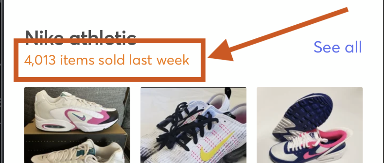
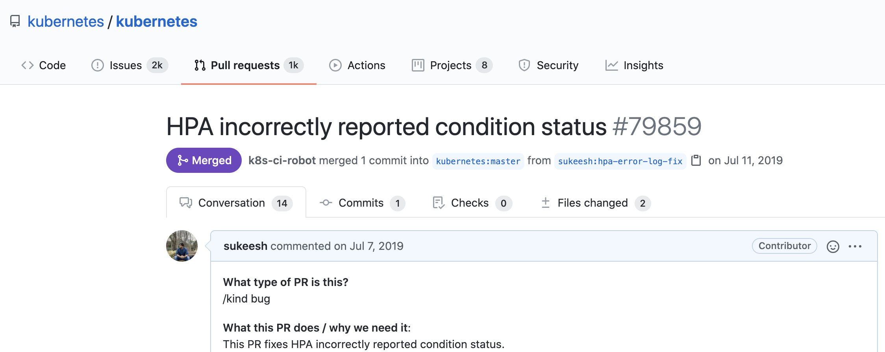
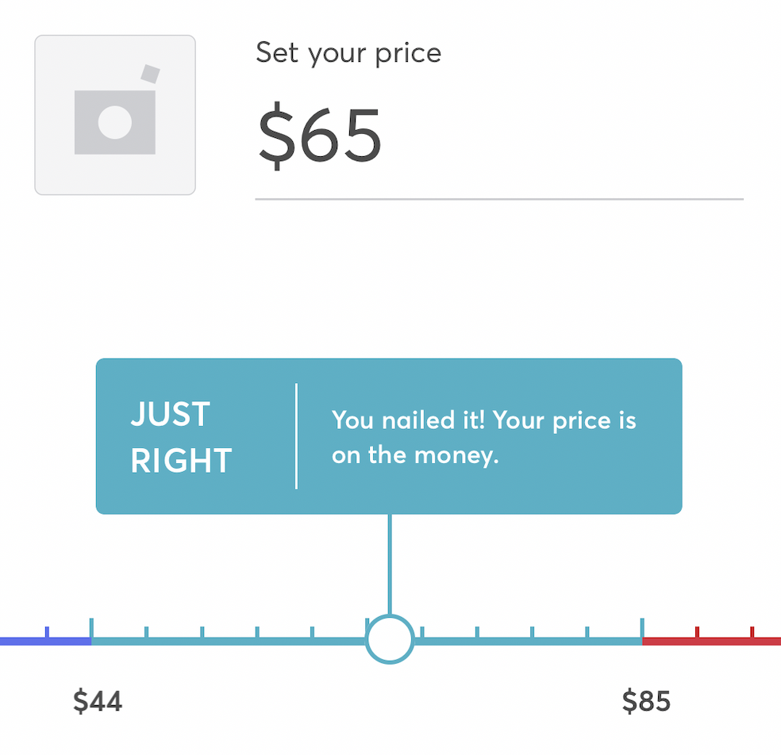
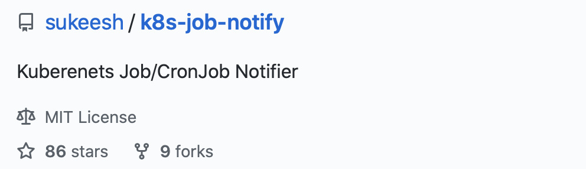
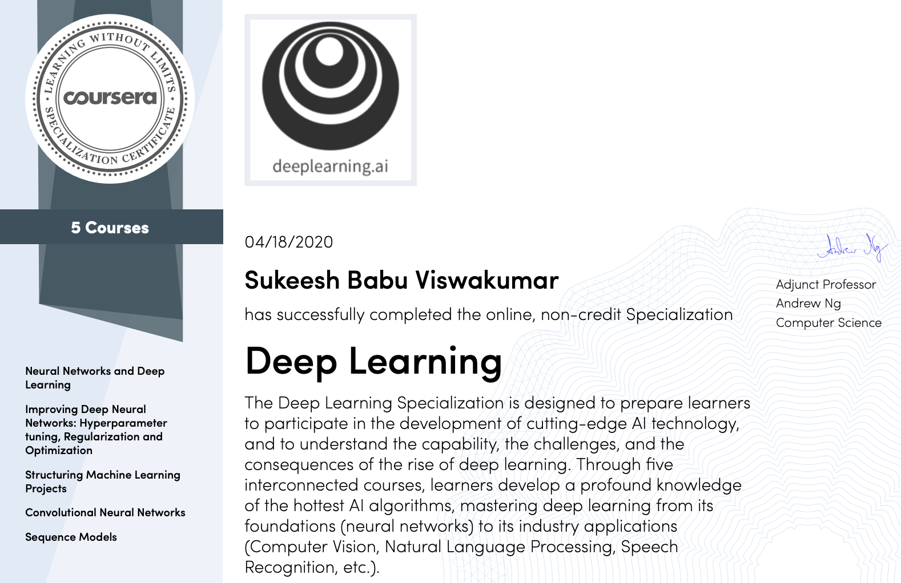
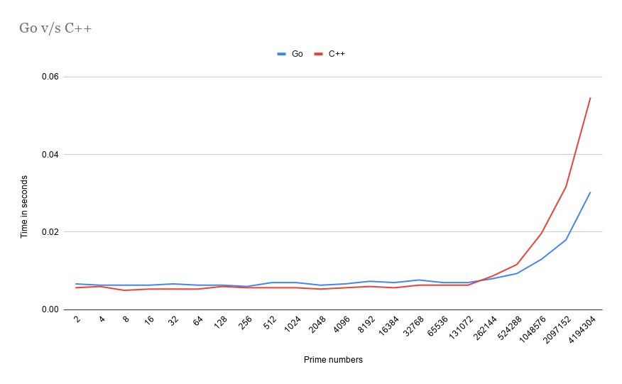
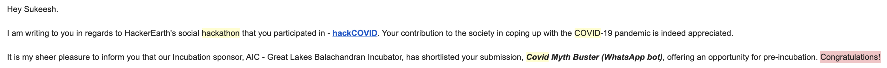

It’s been more than 2 years since I graduated and started working as a Software Engineer at Mercari. So, I thought of putting down everything I did in the past 2 years after I moved to Tokyo, Japan in September 2018.

<br>
My Journey so far has been good at Mercari.


The first month was mostly orientation and at the end of October, I joined the <b>US@Tokyo</b> team as a Backend Engineer.


## Initial days

In the first quarter, I worked on Home API (Golang) in the Backend team. Integrating ML services to the backend. Setting up Prometheus and Grafana for ML Services written in Python Flask.

```diff
+ Golang
+ Prometheus
+ Grafana
+ Kubernetes
+ Docker
```

Below are the <b>few</b> of the components I added on the home screen of mercari in my first quarter<br>


This was very rewarding since everything I write was visible on the home screen of the application.
<br><br>

## (Personal) Hackathon in Tokyo


I participated in a hackathon for the first time in Tokyo and the atmosphere was completely different compared to that of India. Here is the link to my [submission for the Hackathon](https://devpost.com/software/smart-offline-ads).


## Code.. Code.. Code
<p>Later year (2019) in the beginning, I spent time mostly on the Home screen API of the mercari. I worked on adding many many components on Home screen of the application. Here is one of <b>many</b> components I developed. This particular component below gave me experience of working with Search backend.</p>

{:height="50%" width="50%"}

```diff
+ Redis
```

## New microservice :tada:

and then, I finally started working on co-creating a new microservice for saved search. During this first microservice of mine, My learning rate was exponential.


```diff
+ Microservices
+ Cloud Spanner
```

## (Personal) Kubernetes

And also this is when I started to deep dive into Kubernetes. I was super enthusiastic about Cloud native applications and I spent most of my free time reading code of the core [Kubernetes](https://github.com/kubernetes/kubernetes/).



I also started contributing to the Kubernetes open source on GitHub. Here, you can read on [how I started contributing to Kubernetes](https://sukeesh.com/blog/2019-08-01/started-kubernetes).

```diff
+ Istio
```

## Second microservice

In mid-2019, I started working on Price suggestion project which suggests a price range when an user is listing an item on the app.

{:height="40%" width="40%"}

I designed and developed a new backend microservice (written in Golang) for the Price suggestion Machine Learning model.

<!--  -->

We released many many various features around this Price suggestion project and I was the backend engineer initially for all of the projects in this team.

## Payments


During this phase, I also worked parallelly with the Payments team briefly for a feature required in [Mercari GG](https://www.mercari.com/us/digital/).

```diff
+ PHP
```

## (Personal) Project, Kubernetes Job Notifier

{:height="60%" width="60%"}

Monitoring Kubernetes cronjob was little tricky and instantaneous updates are hard. So, I thought of solving this problem. I made use of Kubernetes API and Slack API to create a slack notifier for Kubernetes cronjob failures/success. This project as usual :wink:, gathered few stars and I still keep getting "Thank you" emails from those who are using this tool of mine. [Here is the link to repository on GitHub](https://github.com/sukeesh/k8s-job-notify).

## 2020

Later in January and February of 2020, I worked on various Backend projects including [Mercari Pro seller](https://www.mercari.com/us/become-a-pro-seller/).

```diff
+ BigQuery
```

# Backend -> Machine Learning

In <b>March 2020</b>, I took a decision to move to Machine learning team from Backend team. A complete new vertical and I had literally zero professional experience in Machine learning at this point.

<br>Even after joining ML team, I was still working on Backend only tasks.

<br>So, this is when I decided to gain more theoretical and practical knowledge on ML. I took up the specialization on [deeplearning.ai](deeplearning.ai). I worked hard for about a month to achieve this.

{:height="70%" width="70%"}

This gave me so many insights. It was very practical and I completely recommend this to anyone who is interested in starting their career with ML. <br>

## My First Machine learning model :rocket:

Soon after this, I started working on developing a new Machine learning model for price suggestion. I took up the challenge and was able to train, develop and deploy onto Production in about 1.5 months.

<!--  -->
```diff
+ Polyaxon
+ Many many ML frameworks
```

## (Personal) Finalist in a Hackathon

Again, time for some personal. <br><br>
This time I participated in a Hackathon instead of working on a personal project. Generally, whenever I participate in a Hackathon, winning projects are mostly related to Machine Learning. <br><br>
So, at this point of time since I knew ML and had practical knowledge. I thought of applying ML for the Hackathon project and Surprisingly, I was a <b>finalist</b> and was <b>offered</b> an opportunity for pre-incubation by an Indian Venture Capital firm.



The idea was simple. I developed a WhatsApp bot which fact checks messages related to the Coronavirus.


## Image Recognition

Working with Images has taught me a lot of patience. This is already a running model. My role is more like maintaining the project. <br>

This project is the most interesting because I knew nothing before starting!!

```diff
+ Kubeflow
```

-------


These are **only few** of many projects which I worked on in the past two years. I learnt so many things as a Software engineer. I always tried to take over tasks which are hard/completely unknown to me because later when I look back, I always learnt many things by doing so. 

> Anything which aint hard, isnt worth doing it.

------

## Some links

1. [What can I learn/know right now in 10 minutes that will be useful for the rest of my life?](https://qr.ae/TUtVDd)
